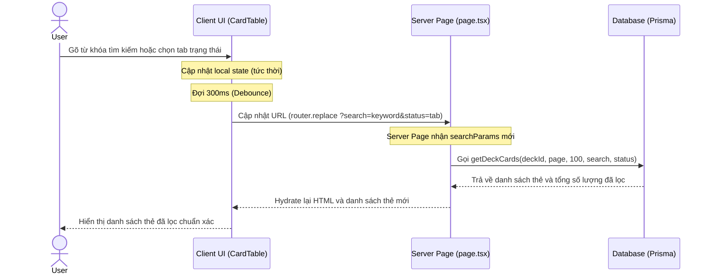

# 🎨 DESIGN: Sửa đổi Giao diện và Luồng Quản lý Thẻ (Card Management UI/UX Fix)

**Ngày tạo**: 07/07/2026  
**Dựa trên**: Codebase thực tế của ứng dụng `nihongo-reflex`  

---

## 1. Thiết Kế Truy Vấn Dữ Liệu (API & Server Actions)

Không có thay đổi về cấu trúc bảng database (Database Schema vẫn giữ nguyên các bảng `Deck` và `Flashcard`). Tuy nhiên, luồng truy vấn được tối ưu hóa bằng cách chuyển bộ lọc tìm kiếm và trạng thái từ client-side về database-side (Server Action).

### Cấu trúc hàm `getDeckCards` mới:
```typescript
export async function getDeckCards(
  deckId: string, 
  page = 1, 
  pageSize = 100,
  search = "",
  status = "ALL"
)
```

### Các điều kiện lọc trong Prisma (SQL):
*   **Search**: 
    ```typescript
    const whereSearch = search ? {
      OR: [
        { front: { contains: search, mode: "insensitive" } },
        { back: { contains: search, mode: "insensitive" } }
      ]
    } : {}
    ```
*   **Status**:
    *   `ALL`: Lấy tất cả các thẻ của deck.
    *   `NEW`: Lấy thẻ có `status === "NEW"`.
    *   `LEARNING`: Lấy thẻ có `status === "LEARNING" || status === "RELEARNING"`.
    *   `DUE`: Lấy thẻ đã đến hạn học, `status === "REVIEW" && nextReviewDate <= now`.

---

## 2. Thiết Kế Màn Hình & Thành Phần (UI/UX Components)

### 2.1. Card Table (`CardTable.tsx`)
*   **Ô tìm kiếm (Search Bar)**: 
    *   Khi người dùng gõ từ khóa, trạng thái local sẽ cập nhật ngay lập tức để ô nhập liệu không bị giật lag.
    *   Sau 300ms (debounce), URL query params sẽ được cập nhật thông qua `router.push("?search=value")` hoặc `router.replace`.
*   **Các Tab Trạng Thái (Status Filters)**:
    *   Bao gồm: All, New, Learning, Due.
    *   Mỗi tab hiển thị tổng số lượng thẻ tương ứng trong toàn bộ Deck (lấy từ database, không phải từ trang hiện tại).
    *   Khi nhấn tab, URL cập nhật `?status=FILTER_NAME&page=1` và Server sẽ tự động fetch lại dữ liệu đúng.
*   **Phân Trang (Pagination)**:
    *   Đồng bộ trực tiếp với số lượng thẻ thực tế sau khi đã lọc.
    *   Ví dụ: Nếu tìm kiếm ra 5 thẻ, phân trang sẽ hiển thị "Page 1 of 1" thay vì giữ nguyên tổng số trang cũ.

### 2.2. Card Editor Dialog (`CardEditorDialog.tsx`)
*   **Sửa lỗi hiển thị**: Thêm điều kiện `if (!isOpen) return null;` ở đầu hàm render.
*   **Giao diện Xem Trước Trực Quan (Live Preview)**:
    *   Bổ sung một bảng preview chia đôi bên dưới hoặc bên cạnh input.
    *   Hiển thị front và back của thẻ dưới dạng một flashcard thực tế (sử dụng Tailwind và Framer Motion).
    *   Hỗ trợ hiển thị đúng định dạng HTML (như thẻ `<b>`, `<br>`, `<i>`, màu sắc) để người dùng thấy ngay kết quả.

---

## 3. Luồng Hoạt Động (User Journey)

### Luồng 1: Tìm kiếm & Lọc thẻ


---

## 4. Checklist Kiểm Tra (Acceptance Criteria)

### Tính năng: Quản lý Thẻ (Card Management)

- [ ] **Màn hình Deck Details**: Không còn bị che bởi lớp overlay tối đen khi vừa mới vào trang. Người dùng có thể click, cuộn và xem danh sách thẻ bình thường.
- [ ] **Tìm kiếm Thẻ**: Gõ từ khóa tìm kiếm sẽ tìm kiếm trong toàn bộ cơ sở dữ liệu của Deck đó (ngay cả các thẻ ở trang 2, trang 3).
- [ ] **Lọc Trạng Thái**: Chọn tab "New", "Learning", "Due" sẽ hiển thị chính xác các thẻ thuộc trạng thái đó trên toàn bộ Deck, phân trang tự động điều chỉnh.
- [ ] **Live Preview**: Khi thêm hoặc sửa thẻ, màn hình preview hiển thị đúng định dạng HTML người dùng nhập vào.
- [ ] **Thêm thẻ liên tục**: Nút "Save & Add Another" xóa sạch form cũ, giữ dialog mở, hiển thị thông báo "Card added!" và trỏ chuột tự động focus về ô nhập "Front".

---

## 5. Thiết Kế Kịch Bản Kiểm Thử (Test Cases)

### TC-01: Kiểm tra Overlay Blocker (Trường hợp sửa lỗi quan trọng)
*   **Given**: Người dùng ở danh sách Deck (`/decks`).
*   **When**: Người dùng bấm chọn một Deck bất kỳ để xem chi tiết.
*   **Then**: 
    *   Trang chi tiết Deck hiển thị đầy đủ thông tin (Deck Overview ở bên trái, Card Table ở bên hợp lý).
    *   Không xuất hiện modal đen mờ phủ màn hình.
    *   Người dùng có thể hover, click vào các nút bấm và ô tìm kiếm bình thường.

### TC-02: Kiểm tra Tìm kiếm xuyên trang (Server-side Search)
*   **Given**: Deck có 150 thẻ. Người dùng đang ở trang 1.
*   **When**: Người dùng gõ một từ khóa nằm ở thẻ số 120 (vốn thuộc trang 2).
*   **Then**: 
    *   Hệ thống tìm kiếm thành công và hiển thị thẻ đó ở danh sách kết quả.
    *   Phân trang cập nhật về `Page 1 of 1`.

### TC-03: Kiểm tra Thao tác Soạn thảo Thẻ (Live Preview)
*   **Given**: Người dùng mở Modal thêm thẻ mới.
*   **When**: Người dùng nhập `Học tiếng Nhật <b>rất vui</b><br>こんにちは` vào ô Front.
*   **Then**: 
    *   Phần Live Preview hiển thị chữ "rất vui" được in đậm và xuống dòng ở chữ "こんにちは".
    *   Không hiển thị thô các thẻ HTML dạng text.

---
*Tạo bởi Antigravity Tech Lead - AWF v4.0*
